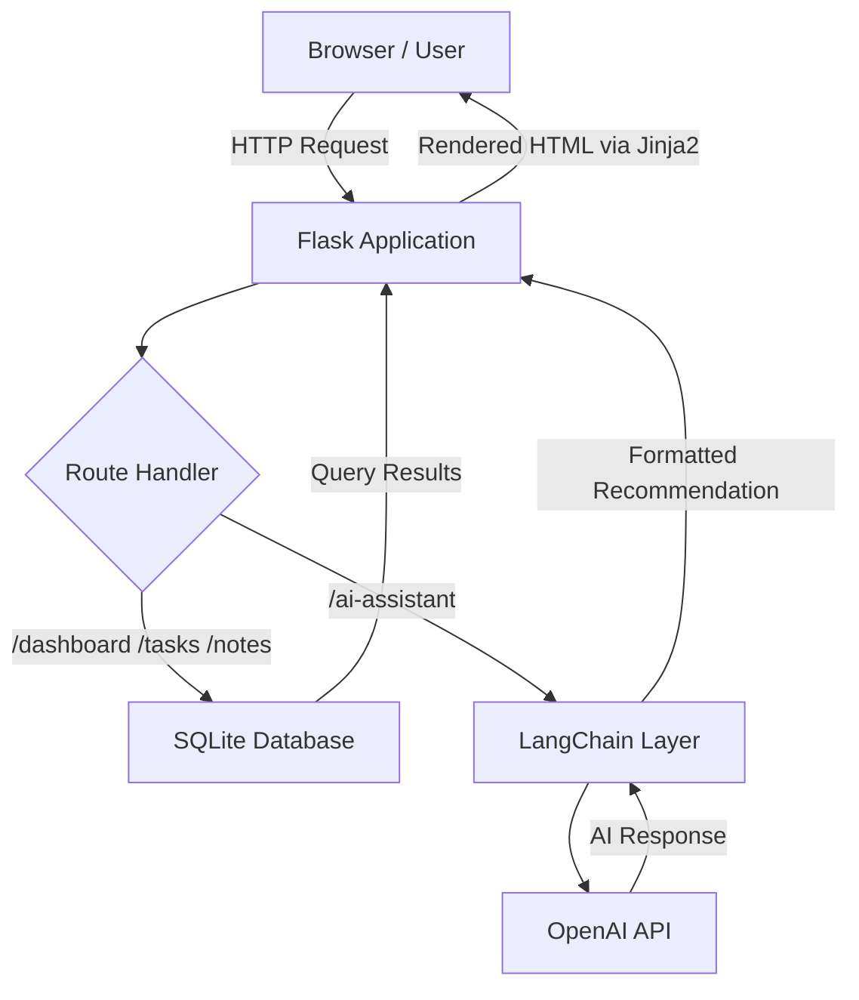
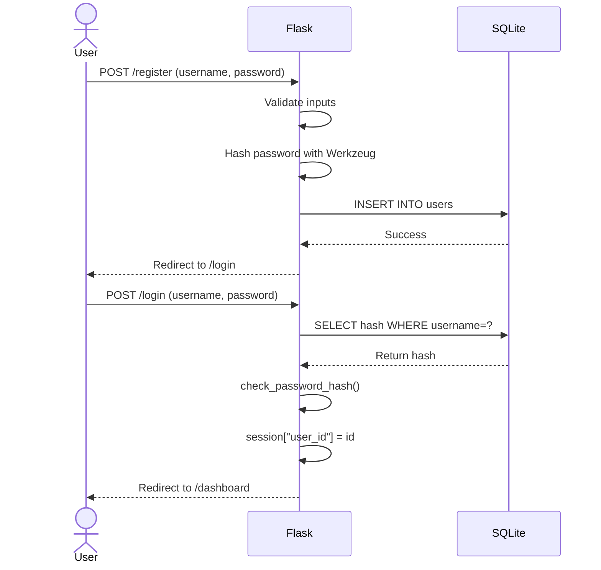
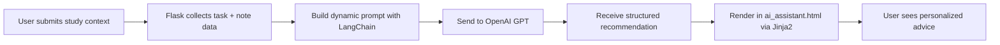
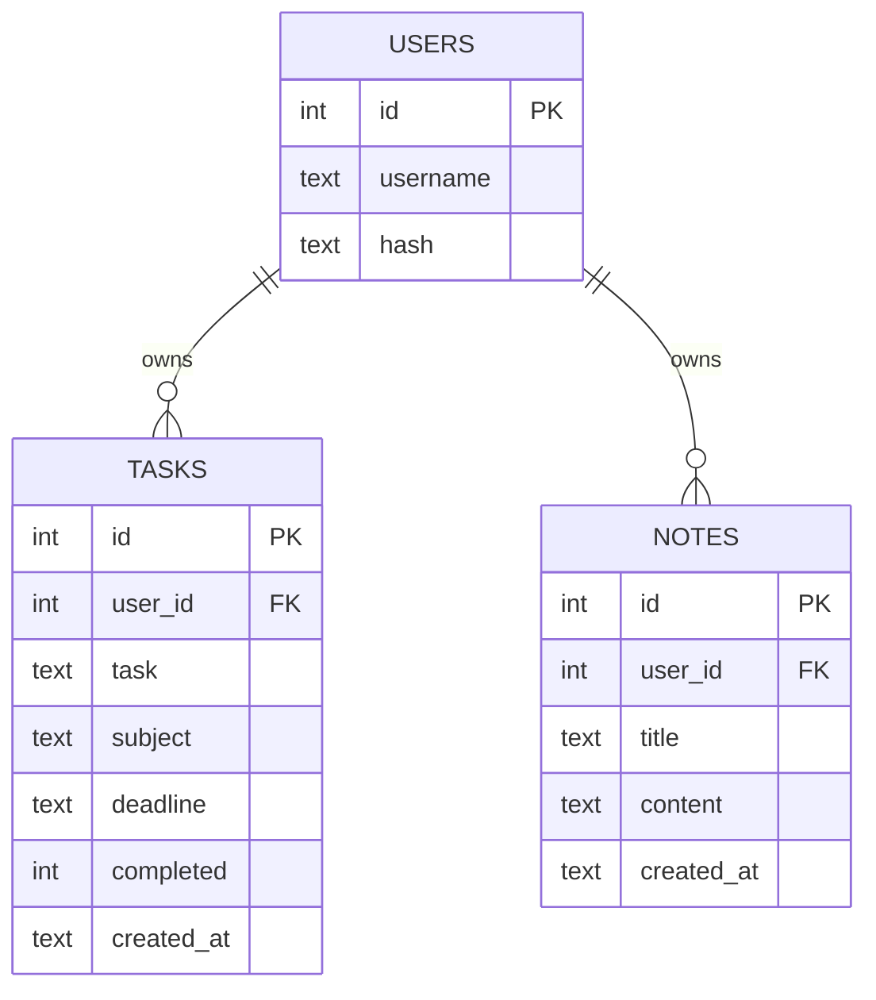

# SkillSync AI
#### Video Demo: https://www.loom.com/share/354260995c3c467b85586e62345077d8      
#### Live Deployment URL: https://skillsync-ai-las7.onrender.com

## Description:
SkillSync AI is an AI-powered student productivity and study management platform...

# 🧠 SkillSync AI

> *An AI-powered student productivity platform — built from scratch, with curiosity and a lot of late nights.*

<div align="center">


**CS50x Final Project · Lakshay Bharti · B.Tech Computer Science (Year 1)**

[Live Demo](https://your-app.onrender.com) · [Report a Bug](https://github.com/lakshay/skillsync-ai/issues) · [Request Feature](https://github.com/DAREDEVIL-OF-NEXUS)

</div>

---

## 📖 Introduction

Honestly, this project started because I was terrible at managing my own study schedule. I'd miss deadlines, lose notes, and spend 20 minutes deciding what to study next. After completing CS50x — which genuinely changed how I think about computers and code — I wanted to build something *real*. Something I'd actually use.

SkillSync AI is a full-stack web application that combines traditional productivity tools (tasks, notes, deadlines) with AI-powered personalized study guidance. You can think of it as a smart study companion — it knows your subjects, tracks what you've completed, and gives you concrete advice on what to focus on next.

"This isn't just another tutorial clone. Every core architectural decision, every database schema configuration, every route, and every SQL query was driven by my own logic and debugged through rigorous trial and error. While I leveraged ChatGPT and Claude as interactive development pairs—using them to generate specific boilerplate snippets or clarify syntax—I made it a strict point to deeply understand every single line of code added to the repository. The process took far longer than I originally anticipated, but it taught me infinitely more than standard coursework ever could about true, self-directed software engineering.

---

## ✨ Features

| Feature | Description |
|---|---|
| 🔐 **Secure Authentication** | Register, login, logout with hashed passwords and session management |
| 📋 **Task Manager** | Add, complete, and delete tasks with deadlines and subject tags |
| 📝 **Notes System** | Create and organize study notes by title and content |
| 🤖 **AI Study Assistant** | Personalized recommendations powered by LangChain + OpenAI |
| 📊 **Analytics Dashboard** | Visual overview of completed tasks and productivity patterns |
| 🎯 **Subject Categorization** | Organize tasks by subject for focused study sessions |
| 📱 **Responsive Design** | Clean, mobile-friendly UI built with Bootstrap 5 |
| ☁️ **Cloud Deployed** | Live and accessible on Render |

---

## 🛠️ Tech Stack

### Frontend
- **HTML5 / CSS3 / JavaScript** — structure, styling, and interactivity
- **Bootstrap 5** — responsive grid, components, and utility classes
- **Jinja2 Templates** — server-side HTML rendering with Flask

### Backend
- **Python 3.11** — core application logic
- **Flask** — lightweight web framework for routing and request handling

### Database
- **SQLite3** — embedded relational database; no server setup required

### AI Layer
- **LangChain** — orchestration framework for prompt chaining and LLM interaction
- **OpenAI API (GPT)** — language model powering study recommendations

### Auth & Security
- **Flask Sessions** — server-side session management
- **Werkzeug** — secure password hashing (`generate_password_hash` / `check_password_hash`)

### Deployment & DevOps
- **Render** — cloud deployment platform
- **Git / GitHub** — version control
- **python-dotenv** — environment variable management

---

## 🏗️ System Architecture

Here's the high-level picture of how everything connects:



### User Authentication Flow



### AI Recommendation Flow



### Database Relationship Diagram



---

## 📁 File Structure

```
SkillSync-AI/
│
├── app.py                  # Main Flask application — all routes and logic
├── helpers.py              # Utility functions: login_required decorator, etc.
├── requirements.txt        # All Python dependencies
├── render.yaml             # Render deployment configuration
├── .env                    # Environment variables (NOT committed to Git)
├── skillsync.db            # SQLite database file
│
├── static/
│   ├── styles.css          # Custom styles on top of Bootstrap
│   └── script.js           # Client-side JavaScript (form validation, UI effects)
│
├── templates/
│   ├── layout.html         # Base template: navbar, Bootstrap, shared structure
│   ├── index.html          # Landing page
│   ├── login.html          # Login form
│   ├── register.html       # Registration form
│   ├── dashboard.html      # Main user dashboard with stats
│   ├── tasks.html          # Task management UI
│   ├── notes.html          # Notes management UI
│   ├── analytics.html      # Productivity analytics page
│   ├── ai_assistant.html   # AI study recommendation interface
│   ├── about.html          # About the project and developer
│   └── apology.html        # CS50-style error page
│
└── README.md
```

### Key Files Explained

- **`app.py`** — The heart of the application. Handles all HTTP routes (`GET`/`POST`), queries the database, manages sessions, and calls the AI layer. Every feature lives here.
- **`helpers.py`** — Keeps `app.py` clean. Houses the `login_required` decorator which redirects unauthenticated users, borrowed and extended from CS50's Finance problem set.
- **`layout.html`** — Jinja2's `` system means every page inherits the navbar and footer from this one file. Change it once, it updates everywhere.
- **`render.yaml`** — Tells Render how to build and run the app on their servers. Three lines of config and it deploys.
- **`.env`** — Stores the `OPENAI_API_KEY` locally. Never committed to GitHub. This is non-negotiable.

---

## 🗃️ Database Design

SkillSync AI uses **SQLite3** — an embedded, file-based relational database. For a project of this scale, it's a perfect choice: zero configuration, zero server management, and it ships as a single `.db` file.

### Schema

```sql
CREATE TABLE users (
    id       INTEGER PRIMARY KEY AUTOINCREMENT,
    username TEXT    NOT NULL UNIQUE,
    hash     TEXT    NOT NULL
);

CREATE TABLE tasks (
    id         INTEGER PRIMARY KEY AUTOINCREMENT,
    user_id    INTEGER NOT NULL,
    task       TEXT    NOT NULL,
    subject    TEXT,
    deadline   TEXT,
    completed  INTEGER DEFAULT 0,
    created_at TEXT    DEFAULT CURRENT_TIMESTAMP,
    FOREIGN KEY (user_id) REFERENCES users(id)
);

CREATE TABLE notes (
    id         INTEGER PRIMARY KEY AUTOINCREMENT,
    user_id    INTEGER NOT NULL,
    title      TEXT    NOT NULL,
    content    TEXT,
    created_at TEXT    DEFAULT CURRENT_TIMESTAMP,
    FOREIGN KEY (user_id) REFERENCES users(id)
);
```

### Why Foreign Keys Matter Here

Every task and every note is linked back to a user via `user_id`. This means when you query tasks, you always filter by `WHERE user_id = session["user_id"]` — so there's no way for User A to accidentally see User B's data. It's a simple but critical security design.

---

## 🔐 Authentication System

Security wasn't an afterthought — it's baked into how the app works from the ground up.

**Password Hashing** — Passwords are never stored as plain text. Werkzeug's `generate_password_hash()` applies a one-way cryptographic hash before anything touches the database. On login, `check_password_hash()` compares the stored hash with the user's input — the actual password never needs to be stored or retrieved.

**Session Management** — After a successful login, Flask stores the user's ID server-side in an encrypted session cookie. Every protected route checks for `session["user_id"]` before serving any data.

**`login_required` Decorator** — Any route that requires authentication is wrapped with this decorator from `helpers.py`. If a user isn't logged in and tries to access `/dashboard`, they get redirected to `/login` immediately.

```python
def login_required(f):
    @wraps(f)
    def decorated_function(*args, **kwargs):
        if session.get("user_id") is None:
            return redirect("/login")
        return f(*args, **kwargs)
    return decorated_function
```

---

## 🤖 AI Integration

This was the part I was most excited — and most nervous — to build.

### How It Works

When a user visits the AI Assistant page, the app:

1. Fetches their pending tasks and recent notes from SQLite
2. Builds a **dynamic, context-aware prompt** using LangChain
3. Sends the prompt to OpenAI's GPT model via the API
4. Receives a structured recommendation and renders it back to the user

The prompt is constructed programmatically — it includes the user's actual subjects, deadlines, and notes — so the AI gives *relevant* advice, not generic tips.

```python
from langchain.prompts import PromptTemplate
from langchain.chains import LLMChain
from langchain_openai import ChatOpenAI

llm = ChatOpenAI(model="gpt-3.5-turbo", temperature=0.7)

template = """
You are a smart academic study advisor helping a student named {username}.
Their current pending tasks are: {tasks}
Their recent notes cover: {notes}
Provide 3 specific, actionable study recommendations for today.
Focus on prioritization, time management, and subject-specific strategies.
"""

prompt = PromptTemplate(input_variables=["username", "tasks", "notes"], template=template)
chain = LLMChain(llm=llm, prompt=prompt)
response = chain.run(username=..., tasks=..., notes=...)
```

### Why LangChain?

I could have called the OpenAI API directly, but LangChain gave me a cleaner structure for managing prompts and chaining logic. It also made the code far easier to extend — if I want to add memory, RAG, or agents later, the foundation is already there.

---

## ⚙️ Installation Guide

### Prerequisites

- Python 3.9 or higher
- pip
- An OpenAI API key ([get one here](https://platform.openai.com))
- Git

### Clone the Repository

```bash
git clone https://github.com/yourusername/skillsync-ai.git
cd skillsync-ai
```

### Create a Virtual Environment

```bash
python -m venv venv

# On macOS/Linux:
source venv/bin/activate

# On Windows:
venv\Scripts\activate
```

### Install Dependencies

```bash
pip install -r requirements.txt
```

### Set Up Environment Variables

Create a `.env` file in the root directory:

```
OPENAI_API_KEY=your_openai_api_key_here
SECRET_KEY=your_flask_secret_key_here
```

> ⚠️ **Never commit your `.env` file to GitHub.** Your `.gitignore` should always include `.env`. Exposing API keys publicly can result in unauthorized charges and security breaches.

### Initialize the Database

```bash
python -c "from app import init_db; init_db()"
```

### Run Locally

```bash
flask run
```

Then open [http://127.0.0.1:5000](http://127.0.0.1:5000) in your browser.

---

## 🔑 Environment Variables

| Variable | Description | Required |
|---|---|---|
| `OPENAI_API_KEY` | Your OpenAI API key for AI features | ✅ Yes |
| `SECRET_KEY` | Flask session encryption key | ✅ Yes |

The app uses `python-dotenv` to load these automatically from `.env` during local development. On Render, these are set as environment variables in the dashboard.

---

## 🚀 Deployment on Render

I chose **Render** because it's free for hobby projects, supports Python natively, and deploying is almost embarrassingly simple.

### Steps

1. Push your project to a GitHub repository
2. Create a new **Web Service** on [render.com](https://render.com)
3. Connect your GitHub repo
4. Set the **Build Command**: `pip install -r requirements.txt`
5. Set the **Start Command**: `gunicorn app:app`
6. Add your environment variables (`OPENAI_API_KEY`, `SECRET_KEY`) under **Environment**
7. Deploy

The `render.yaml` in the repo automates most of this configuration.

> **Note on SQLite and Render:** Render's free tier uses ephemeral storage, meaning the SQLite `.db` file resets on redeploys. For a production version, I'd migrate to PostgreSQL (Render offers a managed free tier). For demo purposes, SQLite works fine.

---

## 📸 Screenshots

> *(Screenshots coming soon — replace with actual images)*

| Page | Preview |
|---|---|
| 🏠 Landing Page | `` |
| 📊 Dashboard | `` |
| ✅ Task Manager | `` |
| 🤖 AI Assistant | `` |
| 📈 Analytics | `` |

---

## 💡 Usage

1. **Register** an account with a username and password
2. **Log in** to access your personal dashboard
3. **Add tasks** with subject tags and deadlines
4. **Create notes** to save important study material
5. **Visit the AI Assistant** to get personalized study recommendations based on your actual workload
6. **Check Analytics** to see your task completion stats over time

---

## 🧩 Design Decisions

**Why Flask over Django?**
Flask is minimal and explicit — you build exactly what you need. For a project where I wanted to understand every layer, Flask made more sense than Django's "magic." CS50 introduced me to Flask and I wanted to go deeper with it.

**Why SQLite over PostgreSQL?**
SQLite requires zero setup and lives in a single file. For a personal productivity app with a single user at a time, there's no performance reason to run a separate database server. When this scales (and I plan to make it scale), migrating to PostgreSQL is straightforward.

**Why Jinja2 Templates?**
Server-side rendering keeps the architecture simple. No separate frontend framework, no API layer to maintain. The data and HTML stay close together, which made development much faster and debugging much cleaner.

**Why LangChain instead of raw OpenAI calls?**
Prompt management gets messy fast. LangChain gave me structure — clean `PromptTemplate` objects, chain composition, and a path toward more advanced features like conversation memory and retrieval-augmented generation (RAG) in the future.

---

## 🚧 Challenges Faced

**Getting the AI context right** was harder than expected. The first few versions gave generic advice like "study harder" — useless. I had to carefully engineer the prompt to include the user's *actual* task data, subjects, and deadlines. Once the prompt became context-aware, the recommendations became genuinely useful.

**Session security** required careful thinking. I had to make sure every database query was scoped to `session["user_id"]` so one logged-in user couldn't access another's data. It sounds obvious, but getting it consistently right across every route took real attention.

**Render + SQLite** was a surprise problem. I discovered mid-deployment that Render's file system is ephemeral — data doesn't persist between deploys. For the demo, I added sample data seeding. For the roadmap, I've planned a PostgreSQL migration.

**Learning LangChain mid-project** — I'd never used it before. The documentation is dense and things change fast. I spent two days reading through it before writing a single line. Totally worth it.

---

## 🔮 Future Improvements

I'm not done with this project. Here's what's coming:

- [ ] 📅 **Calendar Integration** — sync tasks with Google Calendar via OAuth
- [ ] 🧠 **AI Study Planner** — generate a full weekly study schedule from deadlines
- [ ] 📷 **OCR Notes Scanning** — photograph handwritten notes and extract text automatically
- [ ] ❓ **AI Quiz Generator** — auto-generate practice questions from saved notes
- [ ] 🔥 **Streak Tracking** — daily study streak system with motivation rewards
- [ ] 🎙️ **Voice Assistant** — speak your tasks instead of typing them
- [ ] ☁️ **PostgreSQL Migration** — for persistent, production-grade data storage
- [ ] 📱 **Mobile App** — React Native version for iOS/Android
- [ ] 👥 **Study Groups** — share notes and tasks with classmates

---

## 📚 What I Learned

CS50 taught me to think like a programmer. This project taught me to build like one.

Some specific things I came away with:

- **Full-stack mental model** — understanding the complete request-response cycle, from browser click to database and back
- **SQL thinking** — writing relational schemas, using foreign keys, and thinking carefully about data integrity
- **API integration** — working with external services, managing keys, handling errors gracefully
- **Security fundamentals** — why hashing matters, how sessions work, why you never trust user input
- **Prompt engineering** — that the quality of AI output is almost entirely determined by the quality of your prompt
- **Deployment realities** — the gap between "it works locally" and "it works in production" is real and humbling
- **Reading documentation** — half of this project was reading Flask docs, LangChain docs, Bootstrap docs, SQLite docs. Getting comfortable with documentation is a skill in itself.

---

## 🙏 Acknowledgements

- **Harvard CS50x** and Professor David Malan — the course that made all of this possible. The way it builds intuition from the ground up is genuinely extraordinary.
- **The CS50 Duck** 🐥 — for rubber duck debugging sessions at 1am
- **OpenAI and the LangChain community** — for making powerful AI accessible to students
- **Stack Overflow, the Flask docs, and countless GitHub issues** — for saving me more times than I can count
- **My friends who actually tested this app** — your bug reports were brutal and helpful in equal measure

---

## 📄 License

This project is licensed under the **MIT License** — you're free to use, modify, and distribute it. See the [LICENSE](LICENSE) file for details.

---

## 📬 Contact

**Lakshay Bharti**
B.Tech Computer Science · Year 1

[](https://github.com/DAREDEVIL-OF-NEXUS)
[](https://www.linkedin.com/in/lakshay-bharti/)
[](lakshaybharti5160@gmail.com)

<div align="center">

*Built with 💙, Python, and far too much coffee.*

*CS50x Final Project — 2024*

</div>